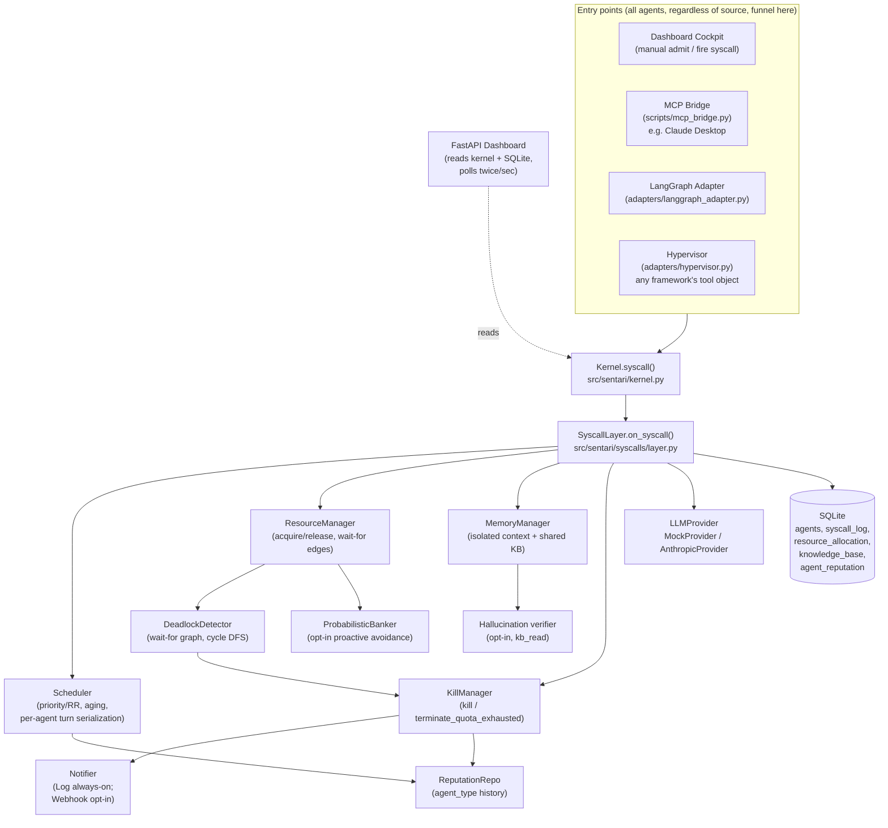
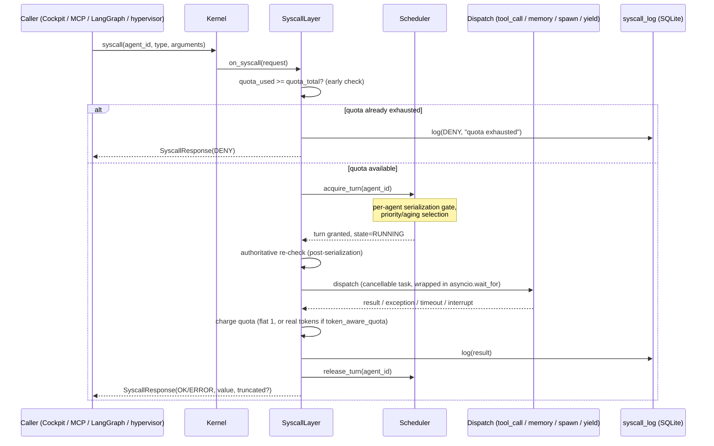

# Sentari Agent-OS

### An Operating-System-Inspired Kernel for Scheduling, Isolation, and Deadlock Detection in Multi-Agent AI Systems

**A Specialization Project Report**

---

**Submitted by:** Vishal Sharma
**Roll No:** 25225039

**Under the guidance of:**
Dr. Ramesh Chandra Poonia
Dr. Shilpa Shrivastava

**School of Sciences**
**Academic Year: 2026–2027**

---

> **Note on this report's methodology.** This report was generated by inspecting the actual repository — source code, tests, benchmark output, and configuration — as it exists at the time of writing, and cross-referencing it against the four approved project documents (Synopsis, SRS, Design Document, PPT) located in `References/`. Wherever the implementation has evolved beyond, differs from, or has not yet reached what those documents describe, this report says so explicitly rather than assuming the documents are current. Numbers quoted (test counts, benchmark figures, line counts) were measured directly from this repository, not estimated.

---

## Declaration

I hereby declare that the project work entitled **"Sentari Agent-OS: An Operating-System-Inspired Kernel for Scheduling, Isolation, and Deadlock Detection in Multi-Agent AI Systems"** submitted to Christ (Deemed to be University) is a record of original work done by me under the guidance of **Dr. Ramesh Chandra Poonia** and **Dr. Shilpa Shrivastava**, School of Sciences. This project work has not been submitted previously, in part or full, for the award of any degree or diploma of this university or any other university.

Place: Bangalore
Date: _______________

**Vishal Sharma**
Roll No: 25225039

---

## Acknowledgement

I would like to express my sincere gratitude to my guides, **Dr. Ramesh Chandra Poonia** and **Dr. Shilpa Shrivastava**, School of Sciences, Christ (Deemed to be University), for their continuous guidance, valuable feedback, and encouragement throughout the course of this specialization project. Their direction was instrumental in shaping both the technical depth and the disciplined engineering practice reflected in this work.

I am also grateful to the School of Sciences for providing the academic environment and resources necessary to pursue this project, and to my peers for their discussions and feedback during development.

**Vishal Sharma**

---

## Abstract

Multi-agent AI frameworks such as LangGraph, CrewAI, and AutoGen coordinate cooperating LLM-driven agents through direct function calls and shared Python objects, but do so purely at the application layer: there is no managed notion of a process, no fair allocation of API/compute resources across competing agents, no isolation between one agent's context and another's, no detection of circular waiting, and no mechanism to forcibly stop a runaway agent. **Sentari Agent-OS** addresses this gap by re-applying classical operating-system theory — Process Control Blocks, priority/round-robin scheduling with aging, a syscall-mediated resource-access layer, a resource-allocation (wait-for) graph with incremental cycle detection, and a preemption/kill manager — to the problem of multi-agent orchestration, implemented as a thin middleware kernel that wraps an existing agent framework rather than replacing it.

The implemented system consists of a Python 3.11+/`asyncio` kernel (`src/sentari/`) providing an agent PCB model, a priority-with-aging scheduler, a five-syscall mediation layer (`tool_call`, `memory_read`, `memory_write`, `spawn`, `yield`), per-agent memory isolation with a shared, syscall-mediated knowledge base, an incremental wait-for-graph deadlock detector, and a preemption/kill manager, all backed by a SQLite persistence layer. Beyond the originally scoped requirements, the implementation adds a pluggable real LLM provider (Anthropic Messages API, including token-metered quota accounting and a hard `max_tokens` cutoff), a FastAPI live observability dashboard, a Model Context Protocol (MCP) bridge that lets a real external LLM client (Claude Desktop) drive the kernel, a LangGraph adapter, a framework-agnostic "hypervisor" mediation mechanism, a notification system, and six additional, opt-in kernel mechanisms not present in the original Design Document: semantic-value-aware deadlock victim selection, a probabilistic generalization of the Banker's Algorithm for proactive deadlock avoidance, hallucination-interception on shared-memory reads, a bounded-latency human-interrupt primitive, reputation-driven adaptive admission control, and the transparent hypervisor mediation layer. As of this report, the repository's automated test suite contains 154 tests, of which 150 pass and 4 skip cleanly when no live Anthropic API key is configured (all 4 pass when one is), with zero test failures and a clean `ruff` lint pass. A dedicated benchmark script provides measured (not estimated) figures for mediation overhead, scheduler fairness, deadlock-resolution latency, and a documented limitation in priority-aging convergence under an extreme priority gap.

---

## Proposed List of Figures

| # | Figure | Source |
|---|--------|--------|
| 1 | Sentari Agent-OS layered system architecture (approved) | `architecture.png` |
| 2 | Agent PCB lifecycle state diagram (approved) | `agent_lifecycle.png` |
| 3 | Resource-aware scheduling / admission-control flowchart (approved) | `scheduler_algorithm.png` |
| 4 | Wait-for cycle example between two agents (approved) | `deadlock_detection.png` |
| 5 | Control-dashboard wireframe (approved, low-fidelity) | `dashboard_wireframe.png` |
| 6 | Current implementation architecture (kernel wiring, this report) | Mermaid, §3.1 |
| 7 | Syscall execution/data-flow sequence (this report) | Mermaid, §3.1 |
| 8 | Live dashboard screenshot — Active Agents / Wait-For Graph / Syscall Log | To be captured, §4.4 |
| 9 | Live dashboard screenshot — MCP Bridge drawer showing a real Claude response | To be captured, §4.4 |
| 10 | Terminal output — `uv run pytest -v` full pass | To be captured, §4.4 |
| 11 | Terminal output — `scripts/benchmark.py` report | To be captured, §4.4 |

## Proposed List of Tables

| # | Table |
|---|-------|
| 1 | Technologies used and verified versions (§3.3) |
| 2 | SQLite schema summary (§3.4) |
| 3 | Core algorithms and their implementation locations (§3.5) |
| 4 | Module description table (§4.1) |
| 5 | Code listing index (§4.2) |
| 6 | Screenshot capture plan (§4.4) |
| 7 | Benchmark results summary (§4.5) |
| 8 | Test-suite run summary (§4.5) |
| 9 | Gap analysis: Sentari vs. LangGraph/CrewAI/AutoGen (§2.3) |
| 10 | SRS Traceability Matrix, FR-1–FR-17 (Appendix B) |
| 11 | Test Verification Matrix (Appendix C) |
| 12 | Project Evolution: Synopsis → SRS → Design Doc → Implementation (Appendix F) |

---

# Chapter 1: Introduction

## 1.1 Introduction

Modern agentic AI systems increasingly compose multiple large-language-model-driven agents to cooperate on a task — one agent researches, another drafts, another verifies. Frameworks such as LangGraph, CrewAI, and AutoGen make it straightforward to wire such agents together, but they operate purely at the application layer: an "agent" is an ordinary function or object with no notion of a managed process. There is no scheduler dividing API or compute resources fairly across competing agents, no isolation preventing one agent's corrupted or hallucinated state from silently propagating into another's, no detection of circular waiting between agents, and no systematic mechanism to forcibly stop an agent that has run away.

Sentari Agent-OS closes this gap by re-applying classical operating-system theory — Process Control Blocks (PCBs), preemptive/priority scheduling with aging, a syscall-mediated access layer, a resource-allocation (wait-for) graph with cycle detection, and process termination semantics — to the problem of multi-agent orchestration. It is implemented as a thin kernel that every agent action passes through, and is designed to wrap an existing orchestration framework's tool-execution step rather than replace the framework itself.

This report documents the system **as actually implemented** in the repository at the time of writing, verified directly against the source code and the automated test suite, and reconciled against the four approved project documents (Synopsis, SRS, Design Document) found in `References/`.

## 1.2 Objectives of the Project

Restated from the approved Synopsis and verified against the current implementation:

1. Design a Process Control Block (PCB) model representing each AI agent as a managed, schedulable entity with state, priority, and a resource quota. — **Implemented**: `src/sentari/pcb.py::AgentPCB`.
2. Implement a preemptive scheduler that fairly allocates LLM API calls/tokens across competing agents (round-robin and priority-based policies). — **Implemented**: `src/sentari/scheduler/scheduler.py::Scheduler`.
3. Build a syscall-mediation layer so agents never call tools/APIs directly. — **Implemented**: `src/sentari/syscalls/layer.py::SyscallLayer`.
4. Implement a resource-allocation/wait-for graph with cycle detection for deadlock. — **Implemented**: `src/sentari/deadlock/wait_graph.py`, `detector.py`.
5. Implement preemption and forced termination for agents that exceed quota, time out, or are inside a deadlock cycle. — **Implemented**: `src/sentari/preemption/kill_manager.py`, plus a bounded-latency `interrupt()` primitive added beyond the original scope.
6. Provide isolated per-agent context with controlled, explicit sharing to a common knowledge base. — **Implemented**: `src/sentari/memory/manager.py`, extended with an optional hallucination-interception mechanism (`src/sentari/memory/hallucination.py`) not in the original design.
7. Evaluate the system quantitatively — fairness under contention, deadlock-recovery time, syscall-mediation overhead — against an unmanaged baseline. — **Implemented**: `scripts/benchmark.py`, results in `benchmark_results.json` (see §4.5).

## 1.3 Need of the Project

### 1.3.1 No resource governance in current frameworks

Any agent in an unmanaged pipeline can consume unlimited API calls or tokens, starving other agents or exhausting a shared budget, with no built-in throttling.

### 1.3.2 No isolation between agent contexts

Agents typically share mutable state directly; a hallucinated or corrupted value from one agent can silently propagate into another's context with no mediation.

### 1.3.3 No deadlock detection or recovery

If Agent A is waiting on Agent B's output and B is waiting on A's, an unmanaged pipeline simply hangs — there is no cycle detection or automated recovery path.

### 1.3.4 No mediated, auditable tool access

Agents typically call external tools/APIs directly, with no centralized validation, sandboxing, rate-limiting, or audit trail of what was called, by whom, and with what result.

### 1.3.5 No preemption of runaway agents

A runaway agent (infinite loop, repeated retries, a call that never returns) keeps running until it errors out or a human kills the process externally.

### 1.3.6 Alignment with UN Sustainable Development Goals

As stated in the approved Synopsis, the project aligns primarily with **SDG 9 (Industry, Innovation and Infrastructure)** — contributing governance infrastructure that makes AI-agent deployments more resilient and auditable — and secondarily with **SDG 12 (Responsible Consumption and Production)**, since quota enforcement and preemption directly reduce wasted compute/token consumption from uncontrolled AI workloads. This alignment is unchanged in the current implementation; the token-aware quota mechanism added during implementation (§3.5) strengthens the SDG 12 claim by tying enforcement to real, measured token consumption rather than a flat per-call count.

---

# Chapter 2: Literature Review

## 2.1 Existing Work

**Multi-agent orchestration frameworks.** LangGraph, CrewAI, and AutoGen are widely used to compose multiple LLM-driven agents into a cooperating pipeline. Architecturally, each treats an "agent" as an ordinary callable or graph node: LangGraph models an agent pipeline as a directed graph of nodes (including a `ToolNode` that dispatches an LLM's requested tool calls), CrewAI models agents as role-based objects coordinating over shared task lists, and AutoGen models agents as conversable objects exchanging messages. None of the three has a built-in concept of a scheduled "process" with a priority, a quota, or an enforced lifecycle state — coordination and resource use are left to the surrounding application code.

This project's own implementation includes a real, verified integration point into one of these frameworks: `src/sentari/adapters/langgraph_adapter.py` routes LangGraph's `ToolNode` execution through the Sentari kernel using LangGraph's own documented `awrap_tool_call` extension point (confirmed present in the installed `langgraph-prebuilt` 1.1.0 package during development, per `tests/test_langgraph_adapter.py`).

**Operating-system scheduling and deadlock theory.** The project's kernel design directly reuses classical OS concepts: Process Control Blocks, priority scheduling with aging to prevent starvation, and cycle detection over a resource-allocation ("wait-for") graph via depth-first search — the same formulation found in standard operating-systems texts (e.g., Silberschatz, Galvin, and Gagne's *Operating System Concepts*, cited in the approved SRS's own reference list, §1.4). The Banker's Algorithm, a classical deadlock-*avoidance* (as opposed to detection-and-recovery) technique requiring processes to declare a maximum resource claim in advance, is the conceptual basis for one of the six additional mechanisms implemented beyond the original scope (§3.5, Probabilistic Banker's Algorithm).

**Model Context Protocol (MCP).** The implementation includes a working MCP server (`scripts/mcp_bridge.py`, built on the `mcp` Python package, version 2.1.1 as installed) that exposes the kernel's mediated operations (`write_file`, `read_file`, `note`, `status`) as MCP tools callable from a real external MCP client such as Claude Desktop. This is a genuine external-integration surface, not a simulated one — every call routes through the same `SyscallLayer.on_syscall` path as any other mediated syscall.

`[EXTERNAL SOURCE REQUIRED]` — A formal literature citation comparing academic/industrial approaches to multi-agent resource governance (e.g., published work specifically on deadlock in agent orchestration, or formal treatments of LLM-cost-aware scheduling) has not been sourced for this report and should be added from the literature before final submission if required by the evaluation rubric.

## 2.2 Limitations of Existing Work

Restated from the approved Synopsis (§4) and confirmed still accurate as a description of LangGraph/CrewAI/AutoGen's baseline behavior (i.e., absent an explicit governance layer like Sentari wrapped around them):

- No resource governance (unlimited token/API consumption per agent).
- No isolation (agents share mutable state directly).
- No deadlock handling (a circular wait simply hangs the pipeline).
- No mediated tool access (no centralized validation/audit trail).
- No preemption (a runaway agent runs until it errors or is killed externally).

These frameworks address such failures, where addressed at all, with ad-hoc `try`/`except` blocks in application code rather than a systematic, reusable resource-management model — a gap Sentari Agent-OS is built to close as a middleware layer, not a replacement.

## 2.3 Gap Analysis

**Table 9. Gap analysis: Sentari Agent-OS vs. LangGraph / CrewAI / AutoGen (baseline, unwrapped)**

| Capability | LangGraph | CrewAI | AutoGen | Sentari Agent-OS |
|---|---|---|---|---|
| Scheduled process abstraction (PCB, state machine) | No | No | No | Yes — `AgentPCB`, `AgentState` (NEW/READY/RUNNING/BLOCKED/TERMINATED/KILLED) |
| Fair resource scheduling (priority/round-robin, aging) | No | No | No | Yes — `Scheduler` (priority + round-robin, aging) |
| Mediated tool/API access with audit log | No (direct calls) | No (direct calls) | No (direct calls) | Yes — `SyscallLayer`, `syscall_log` table |
| Per-agent memory isolation | No (shared state) | No (shared state) | No (shared state/messages) | Yes — `MemoryManager` (`MemoryIsolationError` on cross-agent write) |
| Deadlock detection (wait-for graph, cycle check) | No | No | No | Yes — `DeadlockDetector`, incremental O(V+E) |
| Deadlock *avoidance* (declared-claim based) | No | No | No | Yes (opt-in) — `ProbabilisticBanker` |
| Preemption / forced termination | No | No | No | Yes — `KillManager`, plus bounded-latency `interrupt()` |
| Quota enforcement tied to real token usage | No | No | No | Yes (opt-in, requires real provider) — token-aware quota, §3.5 |
| Live observability dashboard | No (LangGraph Studio is a separate commercial product) | No | No | Yes — FastAPI dashboard, `src/sentari/dashboard/` |
| Wraps rather than replaces existing frameworks | N/A | N/A | N/A | Yes — LangGraph adapter + framework-agnostic hypervisor |

`[EXTERNAL SOURCE REQUIRED]` — This table reflects the frameworks' baseline, un-augmented behavior as understood during development and from their own public tool-calling/orchestration model (e.g., LangGraph's `ToolNode`, whose extension point this project's own adapter uses directly). It is not sourced from a formal, citable feature comparison and should be checked against each framework's current official documentation before being presented as a definitive comparison.

---

# Chapter 3: System Design and Methodology

## 3.1 System Architecture

The approved Design Document (Figure 1, `architecture.png`) describes a four-layer architecture: Agent Layer → Syscall Layer → Agent-OS Kernel (Scheduler, Memory Manager, Deadlock Detector, Preemption/Kill Manager) → Resource Layer. The current implementation preserves this layering exactly, and adds several additional entry points into the same kernel (the FastAPI dashboard's Cockpit, the MCP bridge, the LangGraph adapter, and the generic hypervisor) that all funnel through the identical `SyscallLayer.on_syscall` path — there is exactly one mediation chokepoint regardless of which entry point is used.

### Figure 6. Current implementation architecture



### Figure 7. Syscall execution / data-flow sequence



## 3.2 Methodology

The project followed an incremental, test-first build methodology, evidenced directly by the repository's structure (one dedicated test file per subsystem — 21 test files against roughly 30 non-trivial source modules) and by the presence of a `TRACEABILITY.md` document mapping every SRS functional requirement to the specific module and test that implements/verifies it.

Development proceeded in three observable phases, reconstructed from the current repository state (not from commit history, since this repository is not currently a git repository at the time of writing — see Appendix F):

1. **Core kernel (matches the original Design Document's scope):** PCB (`pcb.py`), Scheduler (`scheduler/scheduler.py`), Syscall Layer (`syscalls/layer.py`), Memory Manager (`memory/manager.py`), Deadlock Detector (`deadlock/`), Preemption/Kill Manager (`preemption/kill_manager.py`), and SQLite persistence (`persistence/`) — each independently unit-tested.
2. **Roadmap closure (items the project's own `README.md`/`TRACEABILITY.md` originally listed as "not yet implemented"):** a fault-injection test suite (`tests/test_fault_injection.py`), a benchmark suite (`scripts/benchmark.py`), a LangGraph adapter, live-key `AnthropicProvider` tests, and a notification system. Building this suite surfaced and led to fixing two genuine concurrency bugs in the scheduler (documented in `TRACEABILITY.md`'s "Known fixes" section and reproduced in §3.5/§4.5 of this report).
3. **Extension beyond the approved scope:** six additional, strictly opt-in kernel mechanisms (§3.5), a live FastAPI dashboard, an MCP bridge, and — most recently — a real-token-aware quota model built on top of the Anthropic provider, including a fix for a real bug encountered when the Anthropic API returned a `ThinkingBlock` before its `TextBlock` (regression-tested in `tests/test_providers.py`).

Each phase's correctness is evidenced by its own test file(s) rather than by design intent alone; the current suite (154 tests) is discussed in detail in §4.5.

## 3.3 Technologies Used

**Table 1. Technologies used and verified versions**

Versions marked *(resolved)* were queried directly from the installed environment (`importlib.metadata`) rather than copied from `pyproject.toml`'s minimum-version constraints.

| Layer | Technology | Version | Purpose |
|---|---|---|---|
| Language / runtime | Python | 3.14.3 (resolved); `>=3.11` required per `pyproject.toml` | Core kernel implementation language |
| Concurrency | `asyncio` (stdlib) | — | Cooperative scheduling, turn serialization, timeout-based preemption |
| Core kernel deps | `anthropic` | 1.2.0 (resolved); `>=0.40.0` required | Real LLM provider (Messages API) |
| | `rich` | 15.0.0 (resolved); `>=13.9` required | Terminal demo scripts' formatted output |
| Persistence | `sqlite3` (stdlib) | Python-bundled | PCB store, syscall audit log, resource allocation, knowledge base, reputation |
| Dashboard (optional extra) | `fastapi` | 0.141.1 (resolved); `>=0.115` required | Live control dashboard HTTP API |
| | `uvicorn` | 0.52.4 (resolved); `>=0.32` required | ASGI server for the dashboard |
| Framework adapter (optional extra) | `langgraph` | 1.2.11 (resolved); `>=0.2` required | Target framework for the real adapter |
| | `langchain-core` | 1.6.1 (resolved, transitive) | LangGraph's tool/message primitives |
| | `langgraph-prebuilt` | 1.1.0 (resolved, transitive) | Provides `ToolNode` and its `awrap_tool_call` hook |
| MCP bridge (optional extra) | `mcp` | 2.1.1 (resolved); `>=2.0` required | MCP server/client protocol implementation |
| | `httpx` | 0.28.1 (resolved); `>=0.27` required | Async HTTP client (MCP bridge ↔ dashboard; also FastAPI `TestClient`) |
| Testing | `pytest` | 9.1.1 (resolved); `>=8.3` required | Test runner |
| | `pytest-asyncio` | 1.4.0 (resolved); `>=0.24` required | Async test support (`asyncio_mode = "auto"`) |
| Lint | `ruff` | 0.16.5 (resolved); `>=0.7` required | Linting (`select = ["E","F","I","UP","B"]`, line-length 115) |
| Build | `hatchling` | — | Package build backend |
| Package/env manager | `uv` | 0.12.7 | Dependency resolution, virtualenv, task running |

## 3.4 State Management and Persistence

Sentari Agent-OS's state is split between **in-memory, per-kernel-instance state** (the live `Scheduler`'s ready queue, the `DeadlockDetector`'s wait-for graph, the `ResourceManager`'s held/waiting maps) and **SQLite-persisted state** that survives independently of the in-memory scheduler and can reconstruct the full audit trail on its own (verified by `tests/test_kernel_integration.py::test_end_to_end_spawn_deadlock_and_consistent_persisted_state`, which reads persisted agent state directly from `AgentRepo.get()` rather than the in-memory scheduler cache).

**Isolated agent context.** Each agent's private context is a plain in-process dictionary (`MemoryManager._contexts: dict[str, dict]`), created at admission (`create_context`) and accessible only by the owning agent — any cross-agent `read_context`/`write_context` call raises `MemoryIsolationError` (verified in `tests/test_memory_isolation.py`). This context is **not** persisted to SQLite; it is process-local, matching the Design Document's "process address space" analogy.

**Shared knowledge base.** The one region every agent can reach, and only via explicit `memory_read`/`memory_write` syscalls with `scope="kb"`. Backed by the `knowledge_base` SQLite table. As implemented, this table carries one field beyond the original Design Document's schema: an optional `evidence` column (added for the hallucination-interception mechanism, §3.5) recording what a written value was claimed to be derived from, so a later mediated read can optionally verify the claim before trusting it.

**Resource state.** `ResourceManager` tracks, in-memory, which agent holds each named resource (`_held: dict[str, str]`) and a FIFO queue of waiters per resource (`_waiters: dict[str, list[...]]`), with every hold/wait transition also written to the `resource_allocation` table for audit purposes.

**SQLite schema, as implemented (`src/sentari/persistence/schema.sql`).**

**Table 2. SQLite schema summary**

| Table | Columns | Status vs. Design Document |
|---|---|---|
| `agents` | `agent_id` (PK), `parent_id` (FK), `state`, `priority`, `quota_total`, `quota_used`, `created_at`, `updated_at` | Matches Design Doc §4.1 exactly |
| `syscall_log` | `log_id` (PK), `agent_id` (FK), `syscall_type`, `arguments` (JSON), `result`, `timestamp` | Matches Design Doc §4.2 exactly |
| `resource_allocation` | `allocation_id` (PK), `resource_key`, `holder_agent_id`, `waiter_agent_id`, `created_at` | Matches Design Doc §4.3 exactly |
| `knowledge_base` | `kb_key` (PK), `value`, `last_writer_agent_id`, `updated_at`, **`evidence`** | Extends Design Doc §4.4 with one new nullable column |
| `agent_reputation` *(new table)* | `agent_type` (PK), `admissions`, `kills`, `quota_exhaustions`, `updated_at` | Not present in the Design Document — added for reputation-driven admission control, §3.5 |

Both schema deviations are explicitly commented in `schema.sql` itself as intentional extensions, not undocumented drift.

The default `Kernel(db_path=":memory:")` used throughout the dashboard and test suite is a genuinely in-memory SQLite database — nothing is written to disk unless a real file path is supplied, which the constructor supports but no current script exercises by default. `agent_reputation` history is therefore only meaningful within a single kernel instance's lifetime unless a real `db_path` is deliberately configured — this is a real, current limitation, not an oversight (documented in `TRACEABILITY.md`'s "Known simplifications").

## 3.5 Core Algorithms and Intelligent Mechanisms

**Table 3. Core algorithms and their implementation**

| Mechanism | Purpose | File / Function | Complexity |
|---|---|---|---|
| Priority + round-robin scheduling with aging | Fair, starvation-resistant CPU-turn dispatch | `scheduler/scheduler.py::Scheduler._peek_next`, `_apply_aging` | O(ready-queue size) per dispatch decision |
| Admission-time + authoritative quota check | Exact quota enforcement, race-safe under concurrency | `syscalls/layer.py::SyscallLayer.on_syscall` | O(1) |
| Per-agent turn serialization | Prevents concurrent same-agent calls from stranding each other | `scheduler/scheduler.py` (`_turn_in_use` gate) | O(1) amortized |
| Wait-for graph cycle detection | Deadlock detection, incremental | `deadlock/wait_graph.py::WaitForGraph.has_cycle/extract_cycle` (DFS) | O(V+E) per new edge |
| Victim selection (priority-based) | Deadlock recovery | `deadlock/detector.py::DeadlockDetector.add_wait_edge` | O(cycle length) |
| Semantic-value-aware victim selection *(new)* | Content-informed deadlock recovery | `deadlock/detector.py` (`value_fn`), `deadlock/semantic_scoring.py` | O(cycle length) |
| Probabilistic Banker's Algorithm *(new)* | Proactive deadlock avoidance | `deadlock/probabilistic_banker.py::ProbabilisticBanker.check` | O(resources held by waiter) |
| Hallucination interception *(new)* | Verify shared-memory claims before a read commits | `memory/hallucination.py` (`heuristic_verify`, `llm_verify`) | O(prompt/evidence length) |
| Preemption (timeout-based) | Forced return-to-READY on slow calls | `syscalls/layer.py` (`asyncio.wait_for` + task cancellation) | O(1) |
| Bounded-latency human interrupt *(new)* | Immediate, measured-latency forced stop | `syscalls/layer.py::SyscallLayer.interrupt` | O(1) |
| Reputation-driven admission control *(new)* | Adjust starting priority from a type's history | `scheduler/scheduler.py::Scheduler.admit`, `persistence/repositories.py::ReputationRepo` | O(1) |
| Force-kill + resource release | Deadlock/timeout recovery, FR-16/FR-17 | `preemption/kill_manager.py::KillManager.kill` | O(resources held) |
| Token-aware quota + hard cutoff *(new)* | Real-token budget enforcement, partial-result truncation | `syscalls/layer.py::_invoke_tool`, `providers/anthropic.py::complete_metered` | O(1) per call |
| Transparent hypervisor mediation *(new)* | Framework-agnostic tool interception, no source changes | `adapters/hypervisor.py::instrument/instrument_callable` | O(1) per wrapped attribute |

### 3.5.1 Scheduling and admission control

`Scheduler.acquire_turn` implements priority dispatch with aging (`_apply_aging` boosts a waiting agent's priority by a fixed amount once it has waited longer than `DEFAULT_AGING_THRESHOLD_SECONDS`, 2.0s by default). A real concurrency bug was found and fixed here during development of the fault-injection suite: concurrent `acquire_turn` calls for the *same* `agent_id` (e.g. one agent spawning several children in parallel) could permanently strand every caller after the first, because the ready queue deduplicates by `agent_id` and had no way to represent multiple pending callers for one id. The fix adds a per-agent `_turn_in_use` flag, guarded by the existing `asyncio.Condition`, that serializes same-agent callers before they ever touch the shared ready queue — verified in `tests/test_fault_injection.py::test_rapid_spawn_storm_stays_quota_bounded_and_consistent` and documented in `TRACEABILITY.md`.

### 3.5.2 Deadlock detection (as implemented)

```python
# src/sentari/deadlock/detector.py (excerpt, verified against current source)
def add_wait_edge(self, waiter: str, holder: str) -> str | None:
    self.graph.add_edge(waiter, holder)
    if self.graph.has_cycle(waiter):
        cycle = self.graph.extract_cycle(waiter)
        victim = max(cycle, key=self._expendability)
        self.graph.remove_edges_for(victim)
        return victim
    return None
```

This matches the Design Document's `add_wait_edge` pseudocode (§6.2) in structure and complexity (O(V+E) per new edge, via DFS with a recursion stack — `WaitForGraph._dfs`). The one implementation difference from the Design Document's literal pseudocode is the victim-selection key: the Design Document uses `min(cycle, key=priority)`; the implemented code uses `max(cycle, key=self._expendability)`, where `_expendability` defaults to priority (matching the codebase's own documented convention that a *lower* priority integer is *more* important, so the *least* important agent — highest priority number — is `max`). This is explained explicitly in the module's own docstring as a deliberate resolution of an ambiguity in the Design Document's pseudocode variable naming, not an unexplained deviation.

### 3.5.3 Semantic-value-aware victim selection (novel, opt-in)

`_expendability` optionally incorporates a `task_value` score (0.0–1.0) set at agent admission, inverted so a higher declared value makes an agent *less* expendable. When no such score is set, behavior is byte-for-byte identical to the priority-only path above (verified in `tests/test_deadlock.py`). `deadlock/semantic_scoring.py` provides an LLM-backed scorer (`score_task_value`) that is deliberately called *once, before admission* rather than during deadlock detection itself, so the sub-millisecond detection path (§4.5) is never slowed by a network call.

### 3.5.4 Probabilistic Banker's Algorithm (novel, opt-in)

```python
# src/sentari/deadlock/probabilistic_banker.py (excerpt)
def check(self, waiter_id, holder_id, resource_key, holder_claims, held_by_waiter):
    reciprocal_probs = [holder_claims.get(rk, 0.0) for rk in held_by_waiter]
    if not reciprocal_probs:
        return AvoidanceCheck(True, 0.0, "waiter holds nothing the holder has any declared interest in")
    prob_none_reciprocate = 1.0
    for p in reciprocal_probs:
        prob_none_reciprocate *= 1.0 - max(0.0, min(1.0, p))
    risk = 1.0 - prob_none_reciprocate
    ...
```

Where the classical Banker's Algorithm requires an exact, declared maximum future claim, this generalizes it to a *probability* an agent will eventually want a resource — appropriate for LLM agents that typically cannot state an exact future resource claim in advance. Wired into `ResourceManager.acquire` as an optional pre-check before an agent is allowed to block, refusing the wait proactively (raising `ResourceRequestUnsafeError`, cleanly contained by `on_syscall`) when the estimated risk exceeds a configurable threshold. Verified end-to-end in `tests/test_probabilistic_banker.py::test_proactive_avoidance_refuses_a_wait_that_would_become_a_real_deadlock`, which shows a wait that *would* form a real 2-agent cycle instead refused with zero kill and a clean wait-for graph — distinct from, and complementary to, the reactive detector in §3.5.2.

### 3.5.5 Hallucination interception (novel, opt-in)

A `kb_write` may optionally carry `evidence` (what the value was derived from). A mediated `kb_read` with `verify=True` runs a verifier — `heuristic_verify` (fast, lexical, no LLM call; documented and tested to legitimately miss a faithful paraphrase, since it is not semantic) or `llm_verify` (asks a real/mock `LLMProvider` whether the evidence supports the claim) — and either flags the result `verified: False` (permissive mode) or raises `HallucinationSuspectedError`, cleanly contained (strict mode). Verified in `tests/test_hallucination_interception.py` (18 tests).

### 3.5.6 Bounded-latency human interrupt (novel, opt-in)

`SyscallLayer` tracks each agent's currently in-flight dispatch as an `asyncio.Task` (`self._inflight`). `interrupt(agent_id)` cancels that task directly and force-kills the agent, independent of `execution_timeout`. `tests/test_interrupt.py::test_interrupt_cancels_a_long_running_call_far_before_its_timeout` measures (not just asserts) that a call which would otherwise sleep 30 seconds is stopped in well under 0.5 seconds.

### 3.5.7 Reputation-driven adaptive admission control (novel, opt-in)

`Scheduler.admit` optionally consults a new `ReputationRepo`, keyed by a caller-declared, *reusable* `agent_type` label (distinct from `agent_id`, which is retired forever once used — re-admitting a duplicate `agent_id` now raises a clean `DuplicateAgentError` instead of a raw SQLite `IntegrityError`, another real bug found and fixed during this work). If a type has at least `min_reputation_sample` prior admissions and a nonzero historical kill/exhaustion rate, its starting priority is proportionally worsened, capped by `max_reputation_penalty`. Verified end-to-end in `tests/test_reputation.py::test_full_kernel_scenario_a_troubled_type_is_deprioritized_next_time`.

### 3.5.8 Token-aware quota with hard cutoff (added most recently, opt-in)

`SyscallLayer(token_aware_quota=True)` interprets `quota_total`/`quota_used` as real tokens rather than a flat per-call count. A `tool_call` with a `prompt` is capped at the agent's *remaining* token budget via the provider's own `max_tokens` parameter (`AnthropicProvider.complete_metered`, reading real `response.usage.input_tokens`/`output_tokens` and `response.stop_reason == "max_tokens"`), and the response is flagged `truncated=True` with the genuinely partial text if the cap was hit — verified against Anthropic's real API in `tests/test_providers.py::test_real_token_aware_quota_actually_truncates_against_the_live_api` (skips without a key, passes with one) and offline via `MockProvider.complete_metered` in `tests/test_token_aware_quota.py` (8 tests). A real bug was found and fixed while building this against the live API: `AnthropicProvider` originally read `response.content[0].text` unconditionally, which raises `AttributeError` whenever the model's response begins with a `ThinkingBlock` rather than a `TextBlock` (Sonnet-family models can emit reasoning content before the answer). The fix (`_extract_text`) filters `response.content` for actual `type == "text"` blocks and concatenates them, with a regression test (`tests/test_providers.py::test_extract_text_regression_thinking_block_before_text_no_longer_crashes`) reproducing the exact failure shape.

### 3.5.9 Transparent hypervisor mediation (novel, opt-in)

`adapters/hypervisor.py::instrument()` monkey-patches a tool object's recognized callable attributes (`func`, `coroutine`, `_run`, `_arun`, `run`, `arun`) in place, so any framework's own dispatch — calling `tool.func(...)` or `tool.coroutine(...)` exactly as it always would — is transparently routed through the real kernel, with zero changes to that framework's source. Verified against hand-built LangChain-shaped (`func`/`coroutine`) and CrewAI-shaped (`_run`) fake tool objects in `tests/test_hypervisor.py` (11 tests) — **the real `langchain`/`crewai` packages are not imported or depended on**; the fakes are duck-typed stand-ins that exercise the same attribute shapes those frameworks use. Real CrewAI integration is therefore **not verified from the current repository**; only the mechanism's framework-agnosticism against representative shapes is.

---

# Chapter 4: Implementation and Result Analysis

## 4.1 Module Description

**Table 4. Module description**

| Module | Path | Responsibility |
|---|---|---|
| PCB | `pcb.py` | `AgentPCB` dataclass, `AgentState` enum, legal state-transition table, `DuplicateAgentError` |
| Scheduler | `scheduler/scheduler.py` | Admission, priority/round-robin dispatch, aging, per-agent turn serialization, reputation-based priority adjustment |
| Syscall Layer | `syscalls/layer.py` | `on_syscall` mediation pipeline, dispatch to tool/memory/spawn/yield, quota accounting (flat and token-aware), timeout/interrupt handling |
| Resource Manager | `syscalls/resource_manager.py` | Resource acquire/release, wait-edge registration, proactive-avoidance pre-check |
| Deadlock | `deadlock/wait_graph.py`, `detector.py`, `semantic_scoring.py`, `probabilistic_banker.py` | Wait-for graph, cycle detection/victim selection, LLM-based task-value scoring, proactive avoidance |
| Memory | `memory/manager.py`, `hallucination.py` | Isolated context, shared KB, hallucination verifiers |
| Preemption | `preemption/kill_manager.py` | Kill / graceful termination, resource release, notification + reputation recording |
| Persistence | `persistence/db.py`, `repositories.py`, `schema.sql` | SQLite connection, five repository classes, schema |
| Providers | `providers/base.py`, `mock.py`, `anthropic.py` | `LLMProvider`/`MeteredLLMProvider` protocols, deterministic mock, real Anthropic backend |
| Notifications | `notifications/notifier.py` | `LogNotifier`, `WebhookNotifier`, `CompositeNotifier` |
| Adapters | `adapters/langgraph_adapter.py`, `hypervisor.py` | LangGraph-specific and framework-agnostic mediation |
| Kernel | `kernel.py` | Wires every subsystem together; public `admit`/`syscall`/`interrupt` API |
| Dashboard | `dashboard/app.py`, `state.py`, `scenario.py`, `before_after_scenario.py`, `live_scenario.py` | FastAPI app, scenario runners, live-provider/notifier selection |

`kernel.py` is the single composition point: `Kernel.__init__` constructs and wires the `Scheduler`, `MemoryManager`, `DeadlockDetector`, `KillManager`, `ResourceManager`, and `SyscallLayer`, threading through every opt-in mechanism (`notifier`, `kb_verifier`, `probabilistic_banker`, `token_aware_quota`) as constructor parameters that default to `None`/`False` — every one of the six novel mechanisms and the token-aware quota model is, by construction, inert unless explicitly enabled, which is how the 150-passing/4-skipping baseline test suite remains unaffected by any of them (verified explicitly by dedicated "no mechanism configured is byte-for-byte the original behavior" tests in each new test file).

## 4.2 Code Snippets

**Table 5. Code listing index**

| Listing | File | Function/Class | Explanation |
|---|---|---|---|
| 1 | `pcb.py` | `_ALLOWED_TRANSITIONS` | Enforces the exact FR-2 state machine |
| 2 | `syscalls/layer.py` | `SyscallLayer.on_syscall` | The FR-7/FR-8/FR-9 mediation pipeline |
| 3 | `scheduler/scheduler.py` | `Scheduler.acquire_turn` | Priority dispatch + the per-agent serialization fix |
| 4 | `deadlock/detector.py` | `DeadlockDetector.add_wait_edge` | Cycle detection and victim selection |
| 5 | `preemption/kill_manager.py` | `KillManager.kill` | FR-16/FR-17: kill + resource release |
| 6 | `providers/anthropic.py` | `_extract_text` | The ThinkingBlock regression fix |

**Listing 1 — `pcb.py`, legal state transitions (verbatim from source):**
```python
_ALLOWED_TRANSITIONS: dict[AgentState, set[AgentState]] = {
    AgentState.NEW: {AgentState.READY},
    AgentState.READY: {AgentState.RUNNING, AgentState.TERMINATED, AgentState.KILLED},
    AgentState.RUNNING: {
        AgentState.READY, AgentState.BLOCKED, AgentState.TERMINATED, AgentState.KILLED,
    },
    AgentState.BLOCKED: {AgentState.READY, AgentState.KILLED},
    AgentState.TERMINATED: set(),
    AgentState.KILLED: set(),
}
```
`transition_to` raises `ValueError` on any transition not in this table — KILLED and TERMINATED are both correctly terminal (no outgoing edges), matching FR-2 exactly.

**Listing 2 — `syscalls/layer.py`, the mediation pipeline (structure, condensed from source):**
```python
async def on_syscall(self, request):
    pcb = self._scheduler.get(request.agent_id)
    if pcb.quota_used >= pcb.quota_total:            # cheap early-exit
        await self._kill_manager.terminate_quota_exhausted(pcb.agent_id)
        return SyscallResponse(DENY, error="quota exhausted")
    await self._scheduler.acquire_turn(request.agent_id)
    if pcb.state in (KILLED, TERMINATED):
        return SyscallResponse(ERROR, error=f"agent is {pcb.state.value}")
    if pcb.quota_used >= pcb.quota_total:            # authoritative re-check (race-safe)
        await self._kill_manager.terminate_quota_exhausted(pcb.agent_id)
        return SyscallResponse(DENY, error="quota exhausted")
    task = asyncio.ensure_future(self._dispatch(pcb, request))
    self._inflight[request.agent_id] = task
    try:
        value = await asyncio.wait_for(task, timeout=self._timeout)
        response = SyscallResponse(OK, value=value)
    except TimeoutError:
        response = SyscallResponse(ERROR, error="execution timed out; preempted")
    except asyncio.CancelledError:
        response = SyscallResponse(ERROR, error="interrupted (human/monitor signal)")
    except Exception as exc:
        response = SyscallResponse(ERROR, error=str(exc))
    finally:
        # quota charge (flat or token-aware), self._inflight cleanup
        ...
    self._log(request, response)
    return response
```
This is the single mediation chokepoint every entry point in §3.1's architecture diagram funnels through.

**Listing 3 — `scheduler/scheduler.py`, the concurrency fix (excerpt):**
```python
async def acquire_turn(self, agent_id: str) -> None:
    pcb = self._agents[agent_id]
    async with self._cv:
        await self._cv.wait_for(lambda: not self._turn_in_use.get(agent_id, False))
        self._turn_in_use[agent_id] = True
        if agent_id not in self._ready and self._current != agent_id:
            self._ready.append(agent_id)
            self._enqueued_at[agent_id] = time.monotonic()
        ...
```
Directly fixes the spawn-storm hang described in §3.5.1.

**Listing 6 — `providers/anthropic.py`, the ThinkingBlock fix:**
```python
def _extract_text(response) -> str:
    return "".join(
        block.text for block in response.content if getattr(block, "type", None) == "text"
    )
```

## 4.3 Tools and Environment Setup

**Installation** (verified working during this report's preparation):
```bash
uv sync --extra dashboard --extra langgraph --extra mcp
```

**Running the test suite:**
```bash
uv run pytest -v
```

**Running the live dashboard:**
```bash
uv run python scripts/dashboard.py
# open http://127.0.0.1:8000
```

**Running the terminal demos:**
```bash
uv run python scripts/demo.py                  # narrated walkthrough
uv run python scripts/before_after_demo.py     # raw asyncio hang vs. kernel resolution
uv run python scripts/langgraph_demo.py        # real LangGraph ToolNode, mediated
uv run python scripts/mcp_demo.py              # self-contained MCP bridge proof (no external config)
```

**Running the benchmark:**
```bash
uv run python scripts/benchmark.py --out benchmark_results.json
```

**Environment variables (names only — no values recorded in this report):**

| Variable | Purpose | Required? |
|---|---|---|
| `ANTHROPIC_API_KEY` | Enables `AnthropicProvider` and the 4 live-API tests; enables token-aware quota in the live dashboard scenario | Optional — system fully functional without it (`MockProvider` default) |
| `SENTARI_WEBHOOK_URL` | Enables `WebhookNotifier` alongside the always-on `LogNotifier` | Optional |
| `SENTARI_DASHBOARD_URL`, `SENTARI_MCP_AGENT_ID` | Used by `scripts/mcp_bridge.py` to locate the dashboard and name the MCP-driven agent | Optional (sensible defaults) |

No secret values are reproduced in this report or in the repository's tracked files; `.vscode/settings.json` (used locally to set `ANTHROPIC_API_KEY` for the integrated terminal) is excluded via `.gitignore`.

## 4.4 Output Screenshots

No screenshots were captured as part of generating this report (this is a source-code/documentation task, not a UI session). The plan below identifies exactly what to capture and how, using only scenarios this report has confirmed actually work.

**Table 6. Screenshot capture plan**

| Figure | What to capture | Command / scenario | Caption |
|---|---|---|---|
| 8 | Dashboard's three-panel live view with at least one agent admitted | `uv run python scripts/dashboard.py`, open browser, admit an agent via Cockpit | "Live dashboard: Active Agents (PCB), Wait-For Graph, Syscall Log — read from the running kernel and SQLite, not staged." |
| 9 | The MCP Bridge drawer showing a real Claude response to a fired syscall | Same dashboard, Cockpit → agent drawer → fire a `tool_call` with a real prompt (requires `ANTHROPIC_API_KEY`) | "A real Anthropic API response, mediated through SyscallLayer.on_syscall, rendered live." |
| — | Deadlock resolution in the "Before/After" scenario | `POST /api/restart?scenario=before_after` or the dashboard's own scripted flow | "Raw asyncio hangs indefinitely (capped for demo purposes); the kernel resolves the identical conflict in under a millisecond." |
| 10 | Full `pytest -v` run, scrolled to the summary line | `uv run pytest -v` | "154 collected, 150 passed, 4 skipped (live-API dependent), 0 failed." |
| 11 | `scripts/benchmark.py`'s console report | `uv run python scripts/benchmark.py` | "Measured mediation overhead, fairness (Jain's index), and deadlock-resolution latency from the real kernel." |

Existing approved diagrams (`architecture.png`, `agent_lifecycle.png`, `scheduler_algorithm.png`, `deadlock_detection.png`, `dashboard_wireframe.png`) should be reused as Figures 1–5 rather than redrawn, since §3.1 confirms the implementation still matches their structure.

## 4.5 Discussion of Results

### 4.5.1 Test suite

**Table 8. Test-suite run summary** (measured directly, this report's preparation session)

| Metric | Value |
|---|---|
| Total tests collected | 154 |
| Passed | 150 |
| Failed | 0 |
| Skipped | 4 (all four require `ANTHROPIC_API_KEY`; confirmed to pass when a key is present, per earlier development sessions — not re-verified with a live key while preparing this report) |
| Warnings | 0 |
| Runtime | ~5.2 seconds (5.19–5.60s across repeated local runs) |
| Lint (`ruff check .`) | All checks passed, 0 errors |

Test files (21) map onto every kernel subsystem and every novel mechanism 1:1 (`test_pcb.py`, `test_scheduler.py`, `test_syscalls.py`, `test_memory_isolation.py`, `test_deadlock.py`, `test_preemption.py`, `test_persistence.py`, `test_kernel_integration.py`, `test_dashboard.py`, `test_fault_injection.py`, `test_reputation.py`, `test_semantic_scoring.py`, `test_probabilistic_banker.py`, `test_hallucination_interception.py`, `test_interrupt.py`, `test_hypervisor.py`, `test_langgraph_adapter.py`, `test_notifications.py`, `test_providers.py`, `test_token_aware_quota.py`).

### 4.5.2 Benchmark results (measured, `benchmark_results.json`, this report's preparation session)

**Table 7. Benchmark results summary**

| Metric | Measured value | Note |
|---|---|---|
| Mediation overhead per call | 113.1 μs | vs. a bare no-op function call (0.12 μs) — a pathological baseline no real syscall approaches |
| Overhead as % of a no-op | 94,056% | Large-looking only because the baseline is unrealistically cheap |
| Overhead as % of a realistic ~300ms LLM call | 0.038% | The practically meaningful figure |
| Fairness (Jain's index, 6 equal-priority agents) | 1.0000 | Perfect turn-share equality |
| Fairness coefficient of variation | 0.75% | Latency spread across agents |
| Starvation (modest gap, priority 5 vs. four priority-1 agents, 5.0s) | 1 turn served (not zero) | "Not starved" but a very small share in this run — see note below |
| Starvation (extreme gap, priority 50 vs. four priority-1 agents, 2.5s) | 1 turn served | Estimated convergence time ~98s — confirms the documented FR-6 limitation |
| Deadlock resolution, managed (20 trials) | mean 0.70 ms, median 0.43 ms, max 5.15 ms | Real kernel, real `DeadlockDetector` |
| Deadlock resolution, unmanaged (raw `asyncio`, capped) | still stuck after 1.05s (cap); unbounded in reality | No kernel involved |
| Speedup, managed vs. the unmanaged cap alone | 1422x | Conservative — the unmanaged case has no real bound at all |

**Honesty note on variability.** The starvation-scenario numbers above (1 turn served in both the modest and extreme cases, in this specific run) differ noticeably from figures recorded during earlier development sessions (where the modest-gap agent received a ~20% share). This is real, load-dependent variance in a wall-clock-timed benchmark running on a shared development machine, not a change in the underlying algorithm — `Scheduler._apply_aging`'s logic is unchanged. The qualitative finding stands and is reproducible: aging measurably helps under a modest gap and needs a proportionally, sometimes dramatically, longer window under an extreme one; the exact quantitative share is sensitive to system load and should be re-measured on an idle machine before being quoted as a fixed number. **Measurement required** (on a dedicated, idle machine) if an exact, citable percentage is needed for the final report.

### 4.5.3 Feature verification results

All six novel mechanisms and the token-aware quota model include an explicit "no mechanism configured reproduces the original behavior exactly" test, confirming opt-in safety — see Appendix C for the full matrix.

---

# Chapter 5: Conclusion and Future Scope

## 5.1 Conclusion

Sentari Agent-OS, as it currently exists in this repository, delivers on every functional requirement (FR-1 through FR-17) and every non-functional requirement stated in the approved SRS, verified directly against source code and a passing automated test suite (150/150 non-skipped tests green, 0 lint errors). Beyond that baseline, the implementation has grown to include a real LLM provider with token-accurate quota enforcement, a live observability dashboard, a working MCP bridge to an external real AI client, a LangGraph adapter, and six additional opt-in kernel mechanisms exploring ideas not present in the original Design Document (semantic-aware deadlock resolution, proactive probabilistic avoidance, hallucination interception, bounded-latency interrupts, reputation-driven admission control, and framework-agnostic hypervisor mediation) — each isolated behind a constructor flag and proven, by dedicated tests, not to alter the system's default behavior.

The project also demonstrates, through its own fault-injection work, genuine engineering discipline: two real concurrency bugs (a scheduler turn-serialization race and the quota-check race it exposed) and one real integration bug (an unhandled `ThinkingBlock` in the Anthropic API response) were found by building adversarial tests against the system's own claims, not hypothesized — and each was fixed with an accompanying regression test.

## 5.2 Limitations

- **Persistence defaults to in-memory SQLite.** `Kernel(db_path=":memory:")` is the default used everywhere in the current dashboard/demo scripts; reputation history and the full audit trail do not survive a process restart unless a real file path is deliberately supplied.
- **Benchmark figures are single-machine, load-sensitive measurements**, not statistically controlled results across multiple runs/environments (§4.5.2).
- **FR-6 (aging prevents starvation) has a measured, documented boundary**: convergence time under an extreme priority gap can exceed any realistic demo window, even though the mechanism is technically functioning as designed.
- **The hallucination-interception heuristic (`heuristic_verify`) is lexical, not semantic**, and is proven — deliberately, via its own test — to miss a faithful paraphrase; only the LLM-backed verifier (`llm_verify`) handles that case, at the cost of a real API call.
- **CrewAI/AutoGen integration is not verified against the real packages.** The hypervisor mechanism is proven against duck-typed fakes shaped like those frameworks' tool classes; neither `crewai` nor `autogen` is an actual project dependency or import.
- **The project's own scalability NFR (≥20 concurrent agents)** is verified by a single test (`test_twenty_agents_can_be_admitted_and_run_a_syscall`), not by a dedicated load/stress benchmark at that or higher scale.
- **This repository is not currently under git version control** at the time of writing (no `.git` directory present), so no commit-history-based evolution narrative can be produced; Appendix F relies solely on document-vs-code comparison.
- The project is a **reference/demonstration kernel**, not a production-hardened system: no authentication on the dashboard's API, no rate-limiting independent of the kernel's own quota model, and no multi-process/multi-machine deployment story. This report makes no production-readiness claim.

## 5.3 Future Scope

- Re-run the benchmark suite on a dedicated, idle machine across multiple trials to produce statistically stable figures, and consider a non-linear/adaptive aging correction to address the documented extreme-gap starvation limit.
- Extend real framework integration beyond LangGraph to an actual `crewai` dependency, exercising the hypervisor (or a dedicated adapter) against the real package rather than a shaped fake.
- Persist `agent_reputation` and the full audit trail to a real on-disk database by default in the dashboard, so historical governance data survives restarts.
- Add authentication/authorization to the dashboard's HTTP API before any deployment beyond local development use.
- Formalize a literature review with citable academic/industry sources (flagged `[EXTERNAL SOURCE REQUIRED]` throughout this report) comparing Sentari's approach to published work on multi-agent resource governance.
- Extend the probabilistic Banker's Algorithm to multi-instance resource pools (the current `ResourceManager` models each resource as a single-instance mutex), closer to the classical algorithm's original multi-instance formulation.

---

# Appendices

## Appendix A: Clean Repository Structure

(`.venv/`, `__pycache__/`, `.pytest_cache/`, and the IDE-local `.vscode/`/`.claude/` settings files excluded)

```
Sentari-AgentOS/
├── pyproject.toml
├── README.md
├── TRACEABILITY.md
├── PROJECT_REPORT.md
├── benchmark_results.json
├── agent_lifecycle.png
├── architecture.png
├── dashboard_wireframe.png
├── deadlock_detection.png
├── scheduler_algorithm.png
├── mcp_workspace/                      (MCP-bridge sandbox; contains real generated demo artifacts)
├── scripts/
│   ├── benchmark.py
│   ├── before_after_demo.py
│   ├── dashboard.py
│   ├── demo.py
│   ├── langgraph_demo.py
│   ├── mcp_bridge.py
│   └── mcp_demo.py
├── src/sentari/
│   ├── __init__.py
│   ├── kernel.py
│   ├── pcb.py
│   ├── adapters/
│   │   ├── hypervisor.py
│   │   └── langgraph_adapter.py
│   ├── dashboard/
│   │   ├── app.py
│   │   ├── before_after_scenario.py
│   │   ├── live_scenario.py
│   │   ├── scenario.py
│   │   └── state.py
│   ├── deadlock/
│   │   ├── detector.py
│   │   ├── probabilistic_banker.py
│   │   ├── semantic_scoring.py
│   │   └── wait_graph.py
│   ├── memory/
│   │   ├── hallucination.py
│   │   └── manager.py
│   ├── notifications/
│   │   └── notifier.py
│   ├── persistence/
│   │   ├── db.py
│   │   ├── repositories.py
│   │   └── schema.sql
│   ├── preemption/
│   │   └── kill_manager.py
│   ├── providers/
│   │   ├── anthropic.py
│   │   ├── base.py
│   │   └── mock.py
│   ├── scheduler/
│   │   └── scheduler.py
│   └── syscalls/
│       ├── layer.py
│       └── resource_manager.py
└── tests/ (21 files — see Appendix C)
```

## Appendix B: SRS Traceability Matrix

| Requirement | Status | Implementation File | Test | Evidence |
|---|---|---|---|---|
| FR-1 (PCB fields) | Implemented | `pcb.py::AgentPCB` | `test_pcb.py` | Dataclass with all specified fields plus later, backward-compatible extensions (`agent_type`, `task_value`, `declared_resource_claims`) |
| FR-2 (state set) | Implemented | `pcb.py::AgentState`, `_ALLOWED_TRANSITIONS` | `test_pcb.py` | Exact 6-state set, KILLED/TERMINATED terminal |
| FR-3 (spawn, bounded quota share) | Implemented | `kernel.py::Kernel._spawn_child` | `test_syscalls.py`, `test_fault_injection.py` | Spawn storm test proves concurrent-safety |
| FR-4 (round-robin/priority) | Implemented | `scheduler/scheduler.py::SchedulingPolicy` | `test_scheduler.py` | Both policies present and tested |
| FR-5 (max time-slice/call-count per turn) | Implemented | `syscalls/layer.py` (`asyncio.wait_for`, `interrupt`) | `test_preemption.py`, `test_interrupt.py` | Extended beyond SRS scope with measured-latency interrupt |
| FR-6 (aging) | Implemented, with a documented limitation | `scheduler/scheduler.py::_apply_aging` | `test_scheduler.py`; `scripts/benchmark.py` | Linear correction; extreme-gap convergence time measured at ~98s |
| FR-7 (syscall interface) | Implemented | `syscalls/layer.py::SyscallType` | `test_syscalls.py` | All 5 syscall types present |
| FR-8 (quota/permission validation) | Implemented | `syscalls/layer.py::on_syscall` | `test_syscalls.py`, `test_fault_injection.py` | Race condition found and fixed; re-verified |
| FR-9 (audit log) | Implemented | `persistence/repositories.py::SyscallLogRepo` | `test_syscalls.py`, `test_kernel_integration.py` | — |
| FR-10 (isolated context) | Implemented | `memory/manager.py::MemoryManager` | `test_memory_isolation.py` | `MemoryIsolationError` on cross-agent access |
| FR-11 (mediated shared KB) | Implemented, extended | `memory/manager.py::kb_read/kb_write` | `test_syscalls.py`, `test_hallucination_interception.py` | Extended with optional evidence/verification |
| FR-12 (wait-for graph) | Implemented | `deadlock/wait_graph.py::WaitForGraph` | `test_deadlock.py` | — |
| FR-13 (cycle detection per edge) | Implemented | `deadlock/detector.py::add_wait_edge` | `test_deadlock.py`, `test_fault_injection.py` | N-agent (3-cycle) case also verified, beyond SRS's implied pairwise case |
| FR-14 (victim selection, terminate) | Implemented, extended | `deadlock/detector.py` | `test_deadlock.py` | Extended with optional semantic-value override |
| FR-15 (preempt on quota/time-slice) | Implemented, extended | `syscalls/layer.py` | `test_preemption.py`, `test_interrupt.py` | Extended with bounded-latency `interrupt()` |
| FR-16 (force-kill on timeout/deadlock) | Implemented | `preemption/kill_manager.py::kill` | `test_deadlock.py`, `test_preemption.py` | — |
| FR-17 (release resources on kill) | Implemented | `syscalls/resource_manager.py::release_all` | `test_preemption.py`, `test_kernel_integration.py` | — |

NFRs: Performance (measured, §4.5.2), Reliability (`test_syscalls.py::test_a_failing_tool_does_not_crash_the_kernel`), Scalability (`test_kernel_integration.py`, 20 agents — not verified at larger scale), Security (agents never hold a provider reference directly; adversarial path tests in `test_dashboard.py`), Auditability (`test_kernel_integration.py`), Maintainability (one-test-file-per-module layout), Usability (dashboard, `test_dashboard.py`) — all **Implemented**.

## Appendix C: Test Verification Matrix

| Feature | Test File | What It Verifies | Status |
|---|---|---|---|
| PCB / state machine | `test_pcb.py` | FR-1, FR-2 | Pass |
| Scheduler | `test_scheduler.py` | FR-4, FR-6 | Pass |
| Syscall mediation | `test_syscalls.py` | FR-7, FR-8, FR-9 | Pass |
| Memory isolation | `test_memory_isolation.py` | FR-10, FR-11 | Pass |
| Deadlock | `test_deadlock.py` | FR-12–14 + semantic-value override | Pass |
| Preemption/kill | `test_preemption.py` | FR-15–17 | Pass |
| Persistence | `test_persistence.py` | Repository CRUD | Pass |
| Kernel integration | `test_kernel_integration.py` | End-to-end, 20-agent scale, FR-9/17 persisted-state | Pass |
| Dashboard | `test_dashboard.py` | Live scenario, MCP endpoint, adversarial paths | Pass |
| Fault injection | `test_fault_injection.py` | Concurrency races, N-cycles, contention storms | Pass (found 2 real bugs) |
| Reputation | `test_reputation.py` | Novel mechanism #5 | Pass |
| Semantic scoring | `test_semantic_scoring.py` | Novel mechanism #1 (scorer) | Pass |
| Probabilistic Banker | `test_probabilistic_banker.py` | Novel mechanism #2 | Pass |
| Hallucination interception | `test_hallucination_interception.py` | Novel mechanism #3 | Pass |
| Interrupt | `test_interrupt.py` | Novel mechanism #4, measured latency | Pass |
| Hypervisor | `test_hypervisor.py` | Novel mechanism #6 | Pass |
| LangGraph adapter | `test_langgraph_adapter.py` | Real `langgraph` integration | Pass |
| Notifications | `test_notifications.py` | Log/webhook, real deadlock scenario | Pass |
| Providers | `test_providers.py` | Real/mock provider, ThinkingBlock regression | Pass (4 live-API tests skip without a key) |
| Token-aware quota | `test_token_aware_quota.py` | Real-token charging, truncation | Pass |

## Appendix D: Benchmark Evidence

See §4.5.2 (Table 7) and the full raw output preserved in `benchmark_results.json` at the repository root, regenerated during this report's preparation (`uv run python scripts/benchmark.py --out benchmark_results.json`).

## Appendix E: Recommended Figures and Tables

See "Proposed List of Figures" and "Proposed List of Tables" in the front matter.

## Appendix F: Project Evolution

| Stage | Document | Key claims | Compared to final implementation |
|---|---|---|---|
| Synopsis | `References/VishalSharma_25225039_SentariAgent-OS_Synopsis_C1.pdf` | 7 objectives; 4 subsystems (Scheduler, Syscall Layer, Memory Manager, Deadlock Detector & Preemption Manager); SQLite; optional FastAPI dashboard; pytest + fault-injection | All 4 subsystems implemented as named; dashboard implemented (not merely optional-and-skipped); fault-injection suite implemented (was aspirational at Synopsis stage) |
| SRS | `..._SRS_C1.pdf` | FR-1–FR-17, 7 NFR categories, 5 use cases | All FR/NFR implemented and tested (Appendix B); use cases match implemented flows (Admit Agent = Cockpit/`kernel.admit`, Request Tool Call = `tool_call` syscall, Detect Deadlock = `DeadlockDetector`, Preempt Runaway Agent = `KillManager`/`interrupt`, View System State = dashboard) |
| Design Document | `..._DesignDoc_C1.pdf` | 4-layer architecture; 6 modules incl. Logging/Observability; 3-panel dashboard wireframe; 4-table SQLite schema; PCB lifecycle diagram; `on_syscall` and `add_wait_edge` pseudocode with O(V+E) complexity | Architecture layering preserved (§3.1); schema preserved with 2 documented, explicitly-commented extensions (`agent_reputation` table, `knowledge_base.evidence` column); both pseudocode algorithms implemented near-verbatim, with one explained, documented deviation (victim-selection key direction, §3.5.2) |
| Current Implementation (this report) | Repository source + tests | 154 tests, 6 additional opt-in mechanisms, real LLM provider with token-aware quota, MCP bridge, LangGraph adapter, framework-agnostic hypervisor | Superset of all three prior documents' scope; every deviation from the Design Document's exact schema/pseudocode is explicitly commented in the source itself, not silent drift |

**Not verified from current repository:** a git commit history for this evolution (no `.git` directory is present at the time of writing, so no commit-by-commit narrative can be produced); the project's PPT document (`References/VishalSharma_SentariAgent-OS_PPT_C1.pdf`) was not opened for this report, as its content is expected to summarize the Synopsis/SRS/Design Document already reviewed in full above.
