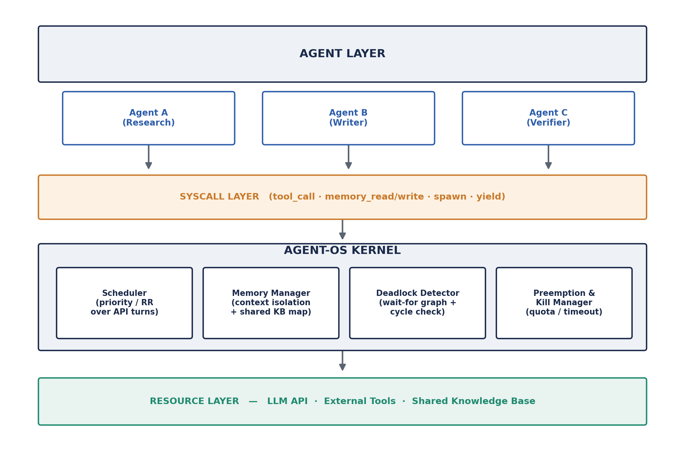
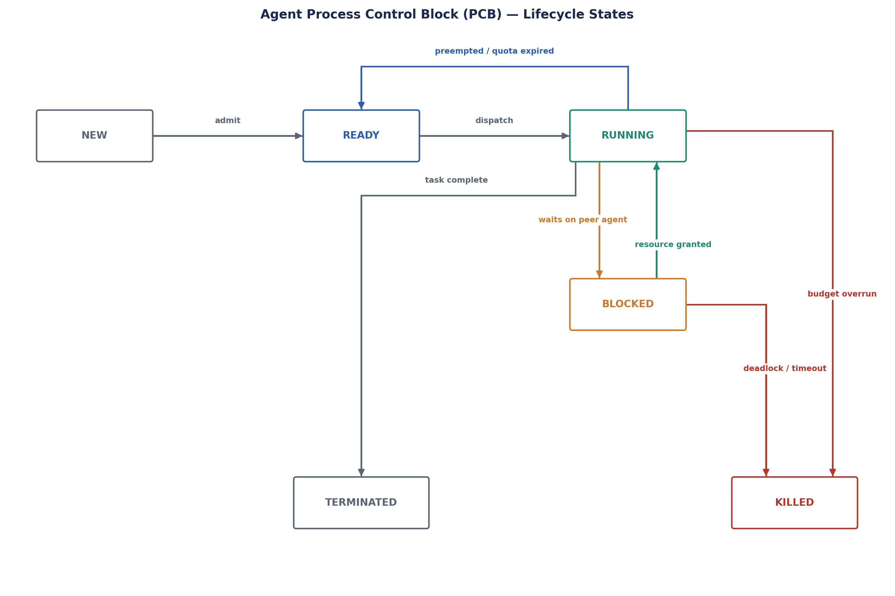
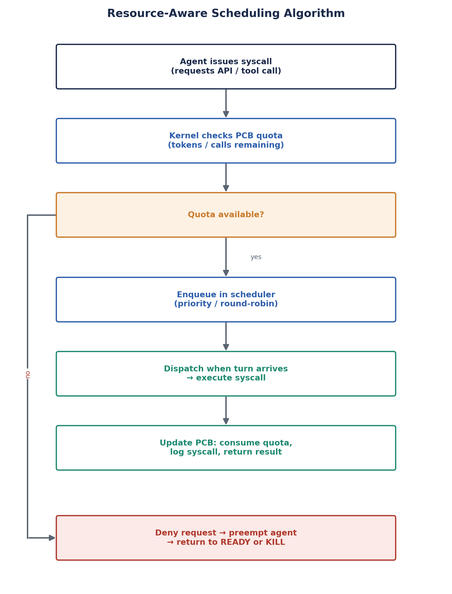
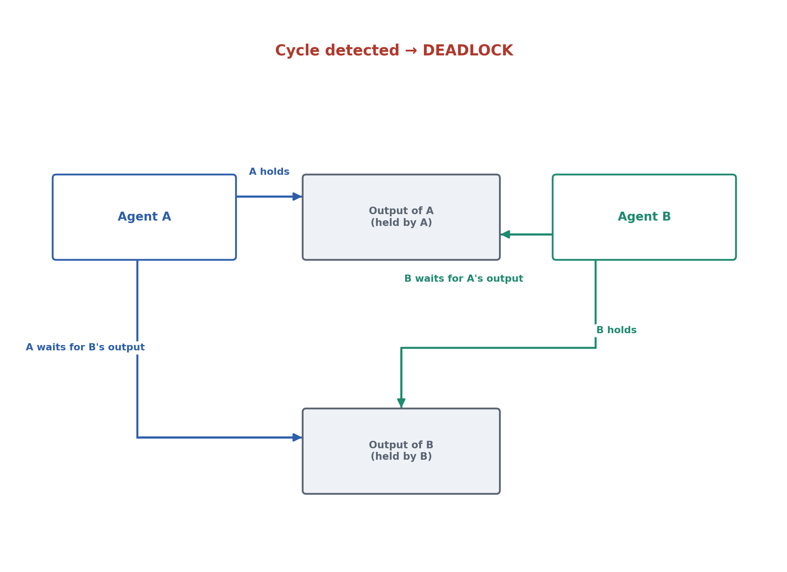
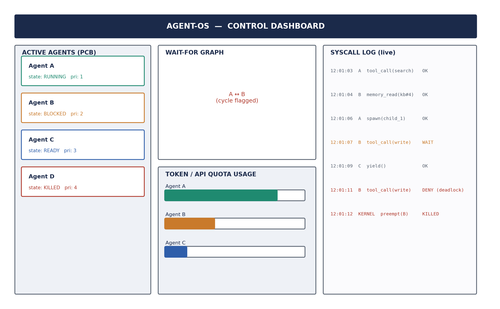

# Sentari — Agent OS

**An operating-system-inspired kernel for scheduling, isolating, and safely running multi-agent AI systems.**

> Status: ✅ Kernel core implemented and tested (PCB, scheduler, syscall layer, memory manager, deadlock detector, preemption/kill manager, SQLite persistence), a live control dashboard, a LangGraph adapter plus a framework-agnostic hypervisor, a fault-injection and benchmark suite, and six additional novel mechanisms beyond the original approved design — see `TRACEABILITY.md` for the full FR-1..17 traceability and mechanism list. 138 tests passing.

---

## 1. What is this, in plain language?

Imagine you hire three interns to work on a report together: one researches, one writes, one fact-checks. Now imagine there's no manager. Any intern can grab the shared laptop whenever they want, edit the same document at the same time, or get stuck waiting for another intern forever without anyone noticing. Nobody's tracking how much time or paper each intern is using. If one intern goes off the rails and starts printing the same page 10,000 times, nobody stops them.

That's roughly the state of most "AI agent" systems today. Frameworks like LangGraph, CrewAI, and AutoGen let you wire multiple AI agents together to cooperate on a task, but they don't actually **manage** those agents — they just let them call each other directly, with no supervisor in the loop.

**Sentari is the manager.** It sits between your AI agents and the outside world (the AI model, the tools, the shared files) and does four jobs a real operating system already knows how to do for computer programs:

1. **Shares resources fairly** — no single agent can hog all the API calls or run up an unlimited bill.
2. **Keeps agents' work separate** — one agent's mistake or confusion doesn't silently leak into another agent's context.
3. **Notices when agents get stuck waiting on each other** — and breaks the deadlock instead of letting everything hang forever.
4. **Shuts down agents that misbehave** — stuck in a loop, over budget, or blocking everyone else? Sentari kills it and moves on.

None of this is a new idea — it's exactly what every operating system (Windows, Linux, macOS) already does for the programs running on your computer. Sentari just applies the same, decades-proven playbook to AI agents instead of programs.

---

## 2. The problem, a little more precisely

Multi-agent AI frameworks today coordinate agents through plain function calls and shared objects. In practice this causes five recurring failures:

| Problem | What actually happens |
|---|---|
| No resource governance | Any agent can consume unlimited tokens/API calls, starving others or blowing the budget |
| No isolation | Agents share mutable state directly; a hallucinated value from one agent can corrupt another's context |
| No deadlock handling | If Agent A waits on Agent B, and B waits on A, the system just hangs — forever |
| No mediated tool access | Agents call tools/APIs directly, with no validation, rate-limiting, or audit trail |
| No preemption | A runaway agent (infinite loop, repeated retries) keeps running until it crashes or a human kills it |

## 3. The solution, a little more precisely

Sentari is a thin **middleware kernel** that every agent action passes through. It does not replace your existing agent framework — it wraps it. Four subsystems do the work:

- **Scheduler** — gives each agent a fair turn at calling the AI model, using the same fairness algorithms (round-robin, priority scheduling) that operating systems use for CPU time.
- **Syscall Layer** — the *only* door an agent can use to call a tool, read/write shared memory, or spawn another agent. Every call is checked and logged before it happens.
- **Memory Manager** — gives each agent its own private workspace, with explicit, controlled access to a shared knowledge base — so nothing leaks by accident.
- **Deadlock Detector & Preemption Manager** — watches for agents waiting on each other in a circle, breaks the cycle, and forcibly stops any agent that overruns its budget or hangs too long.

---

## 4. System Architecture



Every arrow above is a **mediated, logged call** — an agent is never allowed to skip a layer and reach the resources underneath directly. This is the core design principle: agents propose actions, the kernel decides whether and when they happen.

---

## 5. Technical Deep Dive

### 5.1 Core Concept: the Agent PCB

Every agent is represented internally by a **Process Control Block (PCB)** — the same concept used by real operating systems to track running programs. It holds:

- `agent_id`, `parent_id` (for spawned sub-agents)
- `state`: `NEW → READY → RUNNING → BLOCKED → TERMINATED / KILLED`
- `priority` (for scheduling)
- `quota_total` / `quota_used` (token/API-call budget)



An agent moves through these states automatically as it runs. If it exhausts its quota, gets stuck in a deadlock, or times out while blocked, the kernel forces it into `KILLED` and reclaims everything it was holding.

### 5.2 Scheduling Algorithm

Every syscall an agent makes is checked against its remaining quota *before* it's allowed to run. If quota is available, the request is queued and dispatched fairly (round-robin or priority-based); if not, the agent is preempted.



```
function on_syscall(agent, request):
    if agent.quota_used >= agent.quota_total:
        preempt(agent); return DENY
    enqueue(scheduler_queue, agent, request)
    wait_for_turn(agent)
    result = execute(request)              # dispatched turn
    agent.quota_used += cost(request)
    log(agent, request, result)
    return result
```

### 5.3 Deadlock Detection

When Agent A blocks waiting on a resource held by Agent B, an edge `A → B` is added to a **wait-for graph**. A cycle-detection pass (depth-first search) runs immediately on every new edge — not on a slow periodic timer — so circular waits are caught the moment they form.



```
function add_wait_edge(waiter, holder):
    graph.add_edge(waiter, holder)
    if has_cycle(graph, start=waiter):
        cycle = extract_cycle(graph, waiter)
        victim = min(cycle, key=lambda a: a.priority)
        preempt_or_kill(victim)
        graph.remove_edges_for(victim)
```

Complexity: each check is `O(V + E)` over the *current* wait-for graph, which is bounded by the number of agents currently blocked — so detection is effectively immediate in practice.

### 5.4 Observability Dashboard (planned)

A read-only dashboard for development and demos: live agent states, quota usage, the wait-for graph, and a streaming syscall log.



---

## 6. Tech Stack

| Layer | Technology |
|---|---|
| Core kernel | Python 3.11+ (`asyncio`, `dataclasses`) |
| LLM integration | Anthropic / OpenAI API (pluggable provider interface) |
| Frameworks wrapped | LangGraph, CrewAI |
| Persistence | SQLite (PCB store + syscall audit log) |
| Dashboard | FastAPI + lightweight web UI |
| Testing | `pytest` + scripted fault-injection (forced deadlocks, runaway agents) |

## 7. Database Schema

| Table | Purpose |
|---|---|
| `agents` | The live PCB for every registered agent |
| `syscall_log` | Immutable audit trail of every mediated syscall |
| `resource_allocation` | Holder/waiter edges powering the wait-for graph |
| `knowledge_base` | Shared, mediated knowledge store across agents (extended with an optional `evidence` column — see §9) |
| `agent_reputation` | Extension beyond the original design: per-`agent_type` history feeding reputation-driven admission control (see §9) |

## 8. Roadmap

- [x] PCB model + agent registration
- [x] Scheduler (round-robin, then priority + aging)
- [x] Syscall layer with validation + audit logging
- [x] Memory manager / context isolation
- [x] Wait-for graph + cycle detection
- [x] Preemption & kill manager
- [x] Optional observability dashboard
- [x] Fault-injection test suite — `tests/test_fault_injection.py`, plus dedicated suites per subsystem (N-agent cycles, resource-contention storms, spawn storms, adversarial tool exceptions); found and fixed two real bugs (duplicate-agent-id crash, a scheduler concurrency race) along the way
- [x] Benchmark: fairness & overhead vs. an unmanaged baseline — `scripts/benchmark.py`, results in `benchmark_results.json`
- [x] LangGraph middleware adapter — `src/sentari/adapters/langgraph_adapter.py`
- [x] Dashboard/email notifications — `src/sentari/notifications/` (log always-on; webhook opt-in via `SENTARI_WEBHOOK_URL`)
- [x] `AnthropicProvider` tested against the real API — `tests/test_providers.py` (skips cleanly without a key, runs for real with one)

Run the test suite with `uv run pytest -v` (138 tests, all passing; 2 more
skip without a live `ANTHROPIC_API_KEY`). See `TRACEABILITY.md` for the
FR-1..17 → module/test mapping, plus six additional novel mechanisms built
on top of the approved design (semantic-value-aware deadlock resolution,
a probabilistic Banker's Algorithm, hallucination-interception on shared
memory reads, a bounded-latency human interrupt primitive, reputation-driven
adaptive admission control, and a framework-agnostic "hypervisor" for
mediating any third-party agent tool without source changes) — every one
of them opt-in and proven to fall back to the original approved behavior
when not configured.

Run the live dashboard with `uv run python scripts/dashboard.py`, then open
http://127.0.0.1:8000 — it boots directly into a clean, unscripted live
state by default (no staged agents); the scripted Standard-tour/Before-After
walkthroughs used for the original wireframe demo (`dashboard_wireframe.png`)
are still available via `POST /api/restart?scenario=standard|before_after`.

## 9. Why this matters

This project aligns with **UN SDG 9 (Industry, Innovation & Infrastructure)** — building the governance infrastructure that makes multi-agent AI trustworthy enough for real industrial use — and **SDG 12 (Responsible Consumption & Production)**, since quota enforcement and preemption directly cut wasted compute from runaway AI workloads.

## 10. Author

**Vishal Sharma** — Specialization Project, 2026

## License

MIT License

Copyright (c) 2026 Vishal Sharma

Permission is hereby granted, free of charge, to any person obtaining a copy
of this software and associated documentation files (the "Software"), to deal
in the Software without restriction, including without limitation the rights
to use, copy, modify, merge, publish, distribute, sublicense, and/or sell
copies of the Software, and to permit persons to whom the Software is
furnished to do so, subject to the following conditions:

The above copyright notice and this permission notice shall be included in all
copies or substantial portions of the Software.

THE SOFTWARE IS PROVIDED "AS IS", WITHOUT WARRANTY OF ANY KIND, EXPRESS OR
IMPLIED, INCLUDING BUT NOT LIMITED TO THE WARRANTIES OF MERCHANTABILITY,
FITNESS FOR A PARTICULAR PURPOSE AND NONINFRINGEMENT. IN NO EVENT SHALL THE
AUTHORS OR COPYRIGHT HOLDERS BE LIABLE FOR ANY CLAIM, DAMAGES OR OTHER
LIABILITY, WHETHER IN AN ACTION OF CONTRACT, TORT OR OTHERWISE, ARISING FROM,
OUT OF OR IN CONNECTION WITH THE SOFTWARE OR THE USE OR OTHER DEALINGS IN THE
SOFTWARE.
